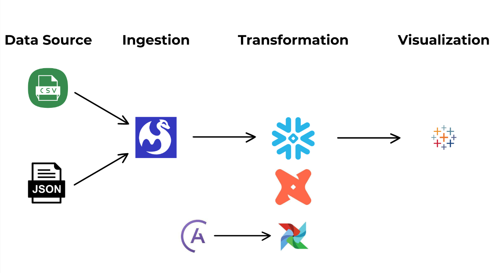
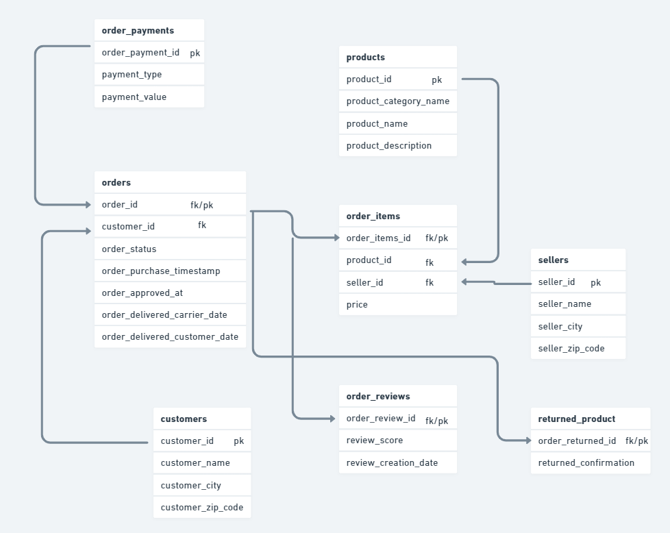

# Project Overview

E-Purwarupa is a company that sells various kinds of products. In its business process, E-Purwarupa uses a website as the main buying and selling instrument. The website contains multiple types of buying and selling data such as user activity, product transactions, and user behavior.
E-Purwarupa seeks to develop analysis based on data-driven decisions for inventory and promotion.

# Project Scope

Challenges: Extract, transform, and load data from multiple sources to analyze product performance.
Key Metrics: Total sales, average sales per period, sales growth, and return rates.

## Table of Contents

- [Dataset](#dataset)
- [Tools Used](#tools-used)
- [Virtual Environment and Pipeline Upgrade](#virtual-environment-and-pipeline-upgrade)
- [Entity Relationship Diagram](#entity-relationship-diagram)
- [Clone Repo](#clone-this-repository)
- [Installation](#installation)
- [Getting Started](#getting-started)
- [Meltano Setup](#meltano-setup)
- [Environment Configuration](#environment-configuration)
- [Extract, Load, and Transform](#extract-load-and-transform)
- [Running the Project](#running-the-project)
- [Environment Variables](#environment-variables)
- [Resources](#resources)

## Dataset

- Orders.csv | [Download file](https://drive.usercontent.google.com/download?id=1jvrGq2XSvJSraxTv0hFoCTJ5FGKNv6AH&export=download&authuser=0&confirm=t&uuid=ac62e281-2096-4a1d-ad68-2c62095f8d86&at=APZUnTVxcC2oizHRnBMYgGQ0Q7K4:1723376085808)
- Order_items.csv | [Download file](https://drive.usercontent.google.com/download?id=1S12qShi_1scqyTmvfMGhzW8bvDU-M_NR&export=download&authuser=0&confirm=t&uuid=bc265abe-4649-406c-8232-5c477fcb0af6&at=APZUnTVAVdAt2jPneNIJP3cyTVsn:1723375639127)
- Order_payments.csv | [Download file](https://drive.usercontent.google.com/download?id=1NScINOTa5-OfRX9EYm6K8whYUxN38jEs&export=download&authuser=0&confirm=t&uuid=5a9232a4-db5d-4778-a10e-2ded7e5b61f5&at=APZUnTXKZSEH6lW_l_OGReZNU3pQ:1723376387522)
- Order_reviews.csv | [Download file](https://drive.usercontent.google.com/download?id=11ogKsU3vz5DuQ7WXE4KvNh7Q_g05LGaN&export=download&authuser=0&confirm=t&uuid=af5ba6fd-9152-4c7e-ab51-910ed78b5db4&at=APZUnTV3R2RxsouxHwgCOyZagfRp:1723376404965)
- Products.csv | [Download file](https://drive.usercontent.google.com/download?id=1UDUSPUYZ_Aj8gEEPEFNzKj_Q4ovq_-e4&export=download&authuser=0&confirm=t&uuid=fd39201a-19bc-4114-8c10-f1b01e4d4448&at=APZUnTX6xKVz3-xAzmpH0H3iDa6f:1723376345392)
- Sellers.csv | [Download file](https://drive.usercontent.google.com/download?id=1ggsGSE2bU_bt-0qR3EiUVPfWwTZXq-s5&export=download&authuser=0&confirm=t&uuid=073b98d6-c64b-428e-b1cb-15267f26ebaa&at=APZUnTVVVIEfc9ImP23w3ZpuAipx:1723376367708)
- Costumers.csv | [Download file](https://drive.usercontent.google.com/download?id=1l1aeM5wXErCwwjvuxFlg50CMaVvA6G2v&export=download&authuser=0&confirm=t&uuid=d14efb1d-44c1-4d62-bfe7-4c16d0b8161a&at=APZUnTWr8U4iyXnpH8Fq9sMF-n3-:1723375415963)
- Returned_products.json | [Download file](https://drive.usercontent.google.com/download?id=1Zl4Qv7TUo8Ffd4NwvVLQV5bN6E044tGj&export=download&authuser=0&confirm=t&uuid=3600c414-1fa0-4f49-a213-dce0e8450d63&at=APZUnTXju0aM-f5OAtDnHK1wTd25:1723376442261)

You can Download Dataset or check this Repository in `path: E-Purwarupa/meltano_porject/data/`

## Tools Used

1. CSV (Data Source 1)
2. JSON (Data Source 2)
3. Meltano (ELT)
    - Plugin Meltano `tap-spreadsheets-anywhere` [Extract]
    - Plugin Meltano `target-snowflake` [Load]
    - DBT-Snowflake [Transform]
4. Snowflake [Data Warehouse]
5. Airflow [Orchestration]

## Data Pipeline Design



## Entity Relationship Diagram



## Clone This Repository

```bash
git clone https://github.com/null-xero/Capstone-Project-DE3.git
```

## Installation

### Check Python

```bash
python3 --version
```

- Recommendation Python Version 3.9 | ex. `3.9.10`
- if your python version is too new, it will affect dbt-snowflake [Maybe dbt-snowflake won't work]

### Astro Installation

To install Astro locally, run the following command:

```bash
curl -sSL install.astronomer.io | sudo bash -s
```

### Virtual Environment and Pipeline Upgrade

Create `.venv`

```bash
python3 -m venv .venv
source .venv/bin/activate
```

Ensure your pipeline tools are up-to-date by upgrading `pip`:

```bash
pip install --upgrade pip
```

### Meltano Installation

To install Meltano, you can use one of the following commands:

```bash
pip install "meltano"
```
or
```bash
pip install --upgrade "meltano"
```

## Getting Started

### Initialize Astro

<!-- Initialize your Astro project with the following command:

```bash
astro dev init
``` -->

Start Astro by running:

```bash
astro dev start
```

### Login Airflow
- Username : `admin`
- Password : `admin`

## Meltano Setup

### Create a Meltano Environment

Refer to the Meltano documentation to create and manage environments:

[Environment Documentation](https://docs.meltano.com/concepts/environments/?meltano-tabs=env)

## Extract, Load, and Transform

### Install Extractor for Raw Data

Install the necessary extractor for your raw data. For example, using the tap-spreadsheets-anywhere extractor:

```bash
meltano add extractor tap-spreadsheets-anywhere
```

[Check for Extractor Documentation](https://hub.meltano.com/extractors/tap-spreadsheets-anywhere)

### Install Loader for Snowflake

Set up the loader for Snowflake to transfer data:

```bash
meltano add loader target-snowflake
```

and

```bash
meltano invoke target-snowflake --initialize
```

Check:

```bash
meltano config target-snowflake
```

[Check for Loader Documentation](https://hub.meltano.com/loaders/target-snowflake)

### Install Transformer for DBT

Set up the DBT transformer for your data transformations:

```bash
meltano add transformer dbt-snowflake
```

[Transformer Guide Documentation DBT Snowflake](https://docs.meltano.com/guide/transformation) `[this is what we use]`

[Utilities for Documentation DBT Snowflake](https://hub.meltano.com/utilities/dbt-snowflake)

### Install Meltano Plugins

Install all the required Meltano plugins:

```bash
meltano install
```

## Environment Configuration

### Environment Variables for Snowflake

Create a `.env` file in the root of your project to securely store your Snowflake credentials and other sensitive information. This helps to maintain privacy and security.

Here's an example `.env` configuration for Snowflake:

```bash
MELTANO_ENVIRONMENT='environment_meltano'

TARGET_SNOWFLAKE_ACCOUNT='Account Snowflake'
TARGET_SNOWFLAKE_USER='User Snowflake'
TARGET_SNOWFLAKE_PASSWORD='Password Snowflake'

DBT_SNOWFLAKE_ACCOUNT='Account Snowflake'
DBT_SNOWFLAKE_USER='User Snowflake'
DBT_SNOWFLAKE_PASSWORD='Password Snowflake'
```

## Running the Project

After setting up your environment and installing the necessary plugins, you can start running your data pipeline and analytics processes.

To run the pipeline for Ingestion Data, execute the following command:

```bash
meltano --environment=dev run tap-spreadsheets-anywhere target-snowflake
```

To run the pipeline using DBT, execute the following command:

```bash
meltano --environment=dev run tap-spreadsheets-anywhere target-snowflake dbt-snowflake:run
```

## Resources

- [Astro Documentation](https://docs.astronomer.io/)
- [Meltano Documentation](https://docs.meltano.com/)
- [Snowflake Documentation](https://docs.snowflake.com/)

Feel free to explore and modify this template to fit your project's needs. Happy coding!
